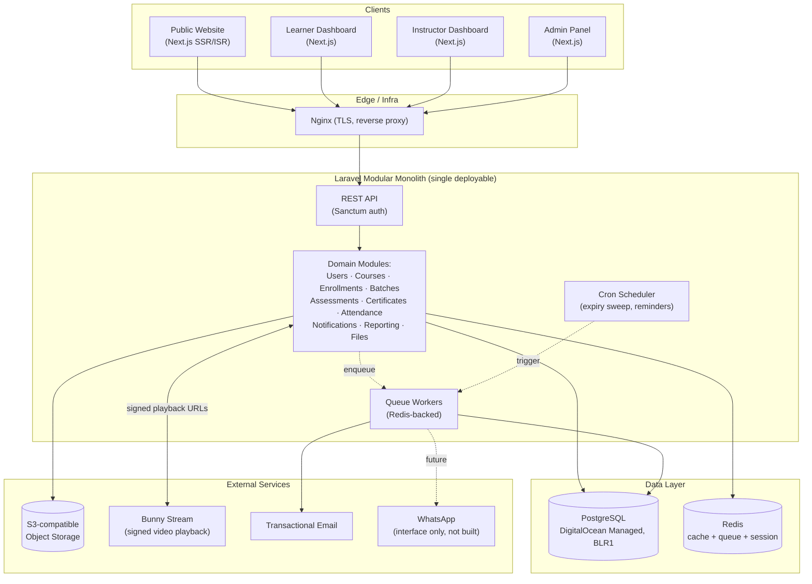
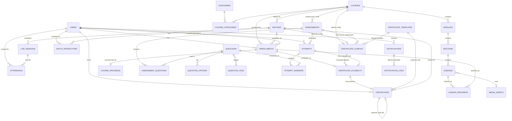
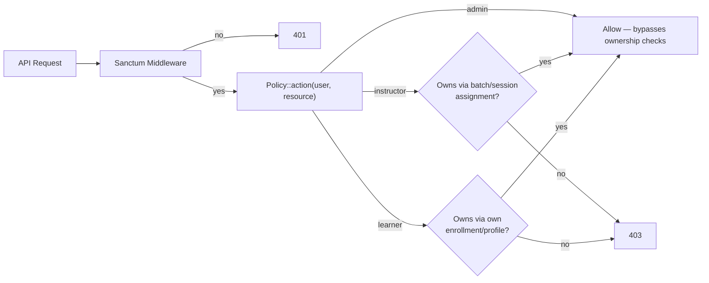
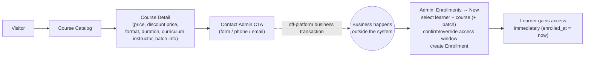
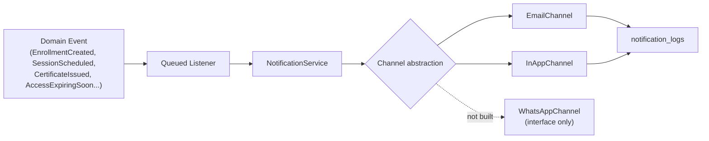
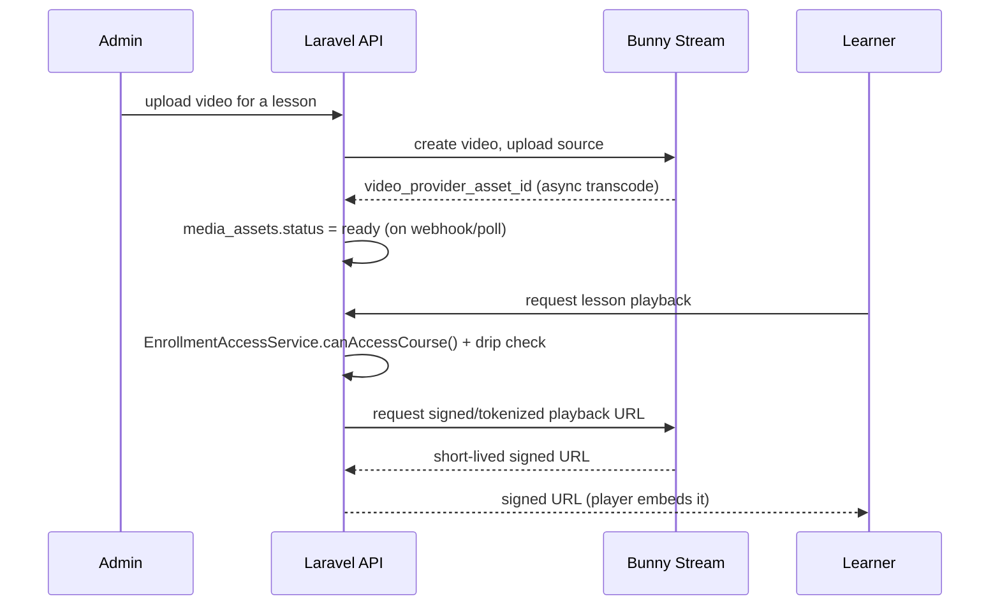
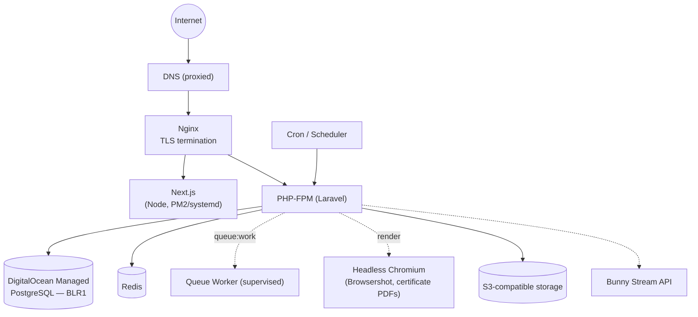

# PoshProfs Trainers LMS — Phase 0: FINAL Architecture & Specification

Status: **FINAL DRAFT — awaiting explicit approval before Phase 1 begins.** No production code has been written. This document supersedes all prior Phase 0 drafts and is the single source of truth; future implementation phases must reference it and not silently deviate.

Prepared: 2026-09-10 · Revision 3 (payments removed from V1, certificate designer added, Oct 20 2026 reinstated as fixed target with scope reduced to fit, Edmingle migration explicitly dropped, database hosting decided)

> **2026-09-11 naming update**: the product's on-screen display name changed from "PoshProfs Trainers" to **"Pro-LMS"**, per an explicit client decision made with full awareness that this replaces the real-brand audit work below (blue `#0E689C` / gold `#F9A825`, Open Sans/Source Sans, pulled live from poshprofstrainers.com) with a new placeholder palette (indigo `#3452DB` / emerald `#10B981`) sourced for nothing in particular, since no brand reference exists yet for "Pro-LMS". **Nothing else in this document changed** — schema, RBAC, certificate logic, timeline, and all other architecture decisions stand as written. The client/business context (PoshProfs Trainers, ~2,844 learners, etc.) driving requirements is unchanged; only the product's own name and UI colors are now generic pending real "Pro-LMS" brand assets. Every "PoshProfs Trainers"/"blue-gold" reference below is left as historical record of that research, not a contradiction to resolve.

---

## What changed in this revision

| Area | Was (Rev 2) | Now (Rev 3 — FINAL) |
|---|---|---|
| **Payments** | Full Razorpay module (orders, payments, webhooks, coupons, GST) | **Removed entirely from V1.** Public flow is Price → Contact Admin → Admin manually enrolls. Architecture leaves a clean extension point, but no payment code/tables exist in V1. |
| **Timeline** | Treated Oct 20, 2026 as a soft target; planned full hardened V1 for ~Q2 2027 | **Oct 20, 2026 is fixed.** Scope has been cut to fit (P0/P1/P2 tiers below), not the other way around. |
| **Certificate templates** | HTML/CSS only | **Dual-mode**: drag-and-drop visual designer (P1) + advanced HTML/CSS editor (P0), sharing one render pipeline. |
| **Certificate revocation** | Not specified | Explicit revoke + replace flow: revoked certificates are never deleted or reused; a replacement is a new certificate row linked to the original. |
| **Edmingle migration** | Flagged as an open decision | **Confirmed out of scope.** Fresh start; nothing migrates. |
| **Video** | Bunny Stream recommended, Mux as alternative | **Bunny Stream confirmed**, no alternative under consideration. |
| **Database hosting** | Flagged as a decision needing a budget call | **Decided**: DigitalOcean Managed PostgreSQL, Bangalore (BLR1) region — see §16. |
| **WhatsApp** | Interface stub, provider TBD | Unchanged — interface stub only, no provider selected, not built in V1. |

---

## 0. TL;DR

- **Modular monolith**: Next.js (TypeScript) + Laravel (PHP) REST API + PostgreSQL (managed, DigitalOcean Bangalore) + Redis + S3-compatible storage + **Bunny Stream** for video. **No payment gateway in V1.**
- **Three roles only**: Admin, Instructor, Learner — enforced server-side via Laravel Policies.
- **Commercial flow in V1**: Course catalog shows price/discount price as marketing information → visitor clicks **Contact Admin** → business happens off-platform → **Admin manually creates the enrollment**. No checkout, no orders, no online payment status anywhere in the system.
- **Certificates** are a major V1 subsystem: eligibility tied to an explicitly designated **Final Course Assessment**, evaluated with strict **AND-only** logic over admin-configurable conditions, overridable per batch, with a **dual-mode template system** (drag-and-drop designer + HTML/CSS editor) and a full revoke/replace lifecycle.
- **Oct 20, 2026 is the fixed target.** It is ~40 days out from this document's date. Scope has been tiered into P0 (must ship by Oct 20) / P1 (ships as soon after as possible) / P2 (explicitly future) — see §21. This is an aggressive schedule; §24 is explicit about where it's tightest.
- **No Edmingle data migration.** Fresh start. Existing certificate *designs* may be recreated in the new template system; no learner/course/progress/certificate records migrate.

---

## 1. System Architecture



**No payments module, no orders, no webhooks from a payment provider.** The only external service integrations in V1 are: object storage, Bunny Stream, and transactional email. This is materially simpler than Rev 2 and directly buys back schedule.

**Why this shape (unchanged from Rev 1/2):** one deployable Laravel app, one Next.js app, one Postgres, one Redis. No service mesh, no distributed transactions. "Modular" means internal code boundaries, not separate processes.

---

## 2. Module Breakdown

| Module | Owns | Talks to |
|---|---|---|
| **Auth** | Registration, login, password reset, Sanctum tokens | Users |
| **Users** | Profiles, role assignment | Auth, all modules |
| **Access Control** | Policies/Gates per role, ownership checks | Every module |
| **Courses** | Course/module/section/lesson CRUD, categories, publish state | Files, Access Control |
| **Course Content** | Drip rules, ordering, preview flags | Courses, Enrollments |
| **Batches** | Batch CRUD, instructor assignment, schedule | Courses, Instructors, Sessions |
| **Enrollments** | Enrollment lifecycle (manual only in V1), access-expiry (single authoritative service) | Courses, Batches |
| **Sessions/Live Training** | Live session scheduling, meeting links | Batches, Attendance |
| **Attendance** | Manual marking, reporting | Sessions, Users |
| **Assessments** | Assessment config, module tests, Final Course Assessment | Question Bank, Enrollments |
| **Question Bank** | Questions, options, tags | Assessments |
| **Certificates** | Templates (designer + HTML), config/eligibility, generation, revocation, verification | Enrollments, Assessments, Files |
| **Notifications** | Channel abstraction (email + in-app now; WhatsApp interface only), queued dispatch | All modules |
| **Reporting** | Read-only aggregation queries, CSV export | All modules |
| **Files/Media** | Storage abstraction, signed URLs, Bunny Stream integration | S3, Bunny Stream |
| **Settings** | Site-wide config (branding, attendance-edit window, defaults) | — |

There is **no Payments/Orders module in V1.** Each module: `Controllers/` (thin) → `Services/` (business rules, single authoritative implementation per rule) → `Policies/` → `Models/` → `Requests/` → `Resources/` → `Jobs/`.

---

## 3. Database ERD



**No `orders`, `payments`, or `coupons` tables in this revision.**

### Core tables (illustrative columns — finalized as Phase 1 migrations)

**users** — `id, name, email (unique), password_hash, role (admin|instructor|learner), phone, status, email_verified_at, timestamps`

**categories** — `id, name, slug (unique), parent_id (nullable, self-ref)`

**courses** — `id, title, slug (unique), description, short_description, thumbnail_media_id, format (self_paced|instructor_led|hybrid), price, discount_price, currency, default_access_days (nullable = lifetime), status (draft|published|archived), created_by, timestamps`. **`price`/`discount_price` are display-only marketing fields in V1** — nothing in the codebase gates access on them.

**course_categories** — pivot `(course_id, category_id)`

**modules / sections / lessons** — hierarchical, `order (int)`, `is_published (bool)`. `lessons` additionally: `type (video|document|text|external), content_body (nullable), media_id (nullable), is_preview (bool), is_required (bool), release_type (immediate|days_after_enrollment|fixed_date|days_after_batch_start), release_value (nullable)`

**media_assets** — `id, owner_type, owner_id, collection, disk, storage_key, filename, mime_type, size_bytes, video_provider (nullable = 'bunny'), video_provider_asset_id (nullable), duration_seconds (nullable), status (uploading|ready|failed), created_by`

**batches** — `id, course_id, name, start_date, end_date, status (upcoming|ongoing|completed|cancelled), access_days_override (nullable), capacity (nullable)`

**batch_instructors** — pivot `(batch_id, user_id)`

**enrollments** — **the authoritative access record**: `id, user_id, course_id, batch_id (nullable), source (manual), enrolled_at, expires_at (nullable = lifetime), status (active|expired|cancelled|completed), enrolled_by (admin user id), notes (nullable), created_at`. Unique `(user_id, course_id, batch_id)`. See §6 for the extensibility note re: future payment sources.

**course_progress** — `enrollment_id (unique), percent_complete, completed_at (nullable), last_accessed_at`

**lesson_progress** — `id, enrollment_id, lesson_id, status (not_started|in_progress|completed), completed_at, watch_seconds (nullable)`. Unique `(enrollment_id, lesson_id)`.

**live_sessions** — `id, batch_id, instructor_id, title, description, scheduled_at, duration_minutes, meeting_provider, meeting_link, status (scheduled|completed|cancelled), recording_url (nullable)`

**attendance** — `id, session_id, user_id, status (present|absent|excused), notes (nullable), marked_by, timestamps`. Unique `(session_id, user_id)`.

**questions / question_options / question_tags** — as before: `question_text, type (single_choice|multiple_choice|true_false), difficulty, marks`; options with `is_correct`; free-tag taxonomy.

**assessments** — `id, course_id (nullable), module_id (nullable), title, type (module_test|standalone), passing_score_percent, time_limit_minutes (nullable), max_attempts (nullable = unlimited), randomize_questions (bool), status`

**assessment_questions** — pivot `(assessment_id, question_id, order, marks_override nullable)`

**attempts** — `id, assessment_id, user_id, enrollment_id (nullable), started_at, submitted_at (nullable), score, percent, passed (bool), status (in_progress|submitted|expired)`

**attempt_answers** — `id, attempt_id, question_id, selected_option_ids (json), is_correct, marks_awarded`

**certificate_templates** — `id, name, mode (designer|html), design_json (nullable — only when mode='designer'; the visual editor's source-of-truth element tree), template_html (text — always present; hand-authored in html mode, compiled from design_json in designer mode), background_media_id (nullable), created_by, timestamps`. See §10.5.

**certificate_configs** — one row per course default (`batch_id IS NULL`) + optional per-batch override: `id, course_id, batch_id (nullable), is_enabled, final_assessment_id (FK → assessments), template_id, auto_generate, cond_completion_enabled, cond_completion_min_percent, cond_assessment_percent_enabled, cond_assessment_percent_min, cond_assessment_marks_enabled, cond_assessment_marks_min, created_by, timestamps`. Partial unique: `(course_id) WHERE batch_id IS NULL` and `(course_id, batch_id) WHERE batch_id IS NOT NULL`.

**certificate_eligibility** — one row per enrollment: `id, enrollment_id (unique), certificate_config_id, best_attempt_id (nullable), status (not_applicable|not_eligible|eligible|issued), condition_results (json), evaluated_at, timestamps`

**certificates** — `id, template_id, certificate_config_id, user_id, course_id, batch_id (nullable), enrollment_id, final_attempt_id (nullable), certificate_number (unique, never reused), verification_code (unique, never reused), issued_at, expires_at (nullable), pdf_media_id, status (active|revoked), revoked_at (nullable), revoked_by (nullable), revoke_reason (nullable), replaces_certificate_id (nullable, self-ref FK)`. Partial unique `(enrollment_id) WHERE status = 'active'`. See §10.6 for revoke/replace.

**notifications / notification_logs** — unchanged from Rev 2: multi-channel dispatch record + delivery log.

**audit_logs** — `id, actor_id, action, entity_type, entity_id, changes (json), ip_address, created_at` — role changes, manual enrollment, access-expiry override, certificate revoke/replace, attendance correction, settings change.

**Design notes (unchanged):** explicit `onDelete` behavior per FK; indexes on primary filter columns; soft deletes on `courses`, `users`, `certificates` — academic history is never hard-deleted.

---

## 4. Authentication & RBAC

Unchanged from Rev 2 — reconfirmed, not re-litigated:

- **Auth**: Laravel Sanctum. **Roles**: single `role` enum on `users`, all authorization in Laravel Policies (one per resource), no permissions package for 3 fixed roles.
- Ownership checks centralized (e.g. `InstructorPolicy::viewBatch()` is the *only* place that rule lives).
- Every API route wrapped in `auth:sanctum` + a Policy check; enforced by an IDOR test suite from Phase 2 onward.



---

## 5. Course & Content Model

Unchanged from Rev 2: `Course → Module → Section → Lesson`. Ordering, publish state, preview flags, completion tracking via a single `course_progress` rollup service. No page-builder.

---

## 6. Enrollment & Access-Expiry Model

The single most important domain rule — **exactly one authoritative implementation**: `EnrollmentAccessService`.

```
Course.default_access_days = 90         (nullable = lifetime)
Batch.access_days_override = nullable   (overrides course default for batch enrollments)

On enrollment creation (V1: always created by Admin, source = 'manual'):
  enrolled_at = now()
  expires_at  = enrolled_at + (batch.access_days_override ?? course.default_access_days) days
                (null if resolved value is null → lifetime access)
```

- **Access check** — `canAccessCourse(user, course)`, called by every content-serving endpoint: enrollment exists, `status = active`, not expired.
- **On expiry** (lazy check + daily sweep): learner keeps account, progress, and any issued certificate. Protected content and video signed-URL issuance denied; dashboard shows "Access expired — contact admin to renew."
- **Admin extension**: only way to extend `expires_at` in V1 (audit-logged).
- Explicitly **not** a subscription engine.

**Extensibility for future payments (architectural note, not a V1 build item):** `enrollments.source` is a small enum with exactly one active value (`manual`) in V1. When payments are added later, the natural extension is a new `payment` value plus a future `orders`/`payments` module whose job is simply to call the *same* enrollment-creation path Admin's manual flow already uses — `EnrollmentAccessService` doesn't change, and no speculative `order_id` column or payment table exists today to maintain in the meantime. This is deliberately the minimum hook, not a partially-built payment system.

---

## 7. Drip Content Model

Unchanged from Rev 2. Four release types (`immediate`, `days_after_enrollment`, `fixed_date`, `days_after_batch_start`), resolved by the same `EnrollmentAccessService`. The API returns each lesson's `unlocked_at`; the frontend never computes drip logic itself.

---

## 8. Batches, Live Sessions & Attendance

Unchanged from Rev 2 — reconfirmed:

- Zero-or-more batches per course; `batch_instructors` (batch-level) vs `live_sessions.instructor_id` (session-level assignment).
- No conferencing built; sessions store an external meeting link. **No automatic attendance detection of any kind.**
- Batch-level `access_days_override` and **certificate rule override** (`certificate_configs` with `batch_id` set — see §10).

### 8.1 Attendance — manual marking flow

1. Admin schedules a `live_sessions` row against a batch, assigns an instructor.
2. Trainer opens Instructor Dashboard → session → sees the batch roster.
3. Marks each learner `present | absent | excused`; **"Mark All Present"** is a frontend default (not a distinct API concept), then the trainer corrects exceptions.
4. Submits as one **bulk upsert**: `PUT /sessions/{session}/attendance` with `{records:[{learner_id, status, notes?}]}`, one transaction.
5. `attendance(session_id, user_id)` unique constraint — the upsert updates existing rows, never duplicates.

**Ownership**: a trainer marks/edits attendance only for sessions where `session.instructor_id == trainer.id`, and only for that session's batch roster — enforced by `AttendancePolicy`. Admin can always view/correct.

**Editing window**: a `Settings` value (default **7 days** after the session date) governs how long a trainer can self-correct; beyond that, Admin-only. This is a runtime setting, not a schema decision, so it's adjustable without a migration.

**Audit**: every correction to a saved record writes to the existing `audit_logs` table (`entity_type='attendance'`) — records are updated, never hard-deleted.

**Reporting**: session/batch/learner attendance history, attendance %, present/absent/excused counts — plain aggregation, no extra schema. Instructor sees their assigned sessions; learner sees **only their own** history.

**Certificates**: attendance is **not** a certificate condition in V1 (§10).

---

## 9. Assessment Model & Final Course Assessment

- **Question Bank** — single source of questions, tagged (subject/topic/exam/difficulty), reusable across assessments.
- An **Assessment** pulls a fixed question set (optionally shuffled per attempt — order-only, not per-learner sampling).
- Attaches to a `module` (module test) **or** a `course` (standalone) — never both. A course-level standalone assessment can be designated the **Final Course Assessment** for that course/batch (§10) — an explicit admin action, not an assumption that any assessment qualifies.
- **Attempts**: nullable `max_attempts` (unlimited) and `time_limit_minutes` (untimed). Scoring computed server-side only. MCQ single-choice, multiple-choice, true/false — no essay/manual grading in V1.
- **Best valid attempt** — `AttemptSelectionService::bestValidAttempt()` picks the highest-`percent` **submitted** attempt (ties broken by raw `score`); `in_progress`/`expired` attempts never count. Used for certificate eligibility (§10) — the 58%/74%/81% example uses 81%.

---

## 10. Certificate System

The largest V1 subsystem, split cleanly into four layers per the requirement: **Template → Configuration/Rules → Eligibility → Issuance.**

### 10.1 Configuration & the AND-only eligibility rule

`certificate_configs` holds the whole rule set per course, with an optional batch override, resolved by **one** function:

```
CertificateConfigResolver::resolve(enrollment)
  1. If enrollment.batch_id is set AND a certificate_configs row exists for that batch_id → use it.
  2. Else use the certificate_configs row where batch_id IS NULL (the course default).
  3. If neither exists, or is_enabled = false → not applicable; no evaluation runs.
```

This is exactly the Batch A / Batch B example from the requirement — two rows in `certificate_configs`, resolved by the same function, never per-batch conditionals scattered through the code.

| # | Condition | Always required? | Configurable? |
|---|---|---|---|
| 0 | Final Course Assessment has ≥1 **submitted** attempt | Yes — the trigger precondition, not a toggle | No |
| 1 | `course_progress.percent_complete >= cond_completion_min_percent` | Only if `cond_completion_enabled` | Enable + threshold |
| 2 | best attempt `percent >= cond_assessment_percent_min` | Only if `cond_assessment_percent_enabled` | Enable + threshold |
| 3 | best attempt `score >= cond_assessment_marks_min` (raw marks) | Only if `cond_assessment_marks_enabled` | Enable + threshold |

`eligible = conditions.filter(enabled).every(passed)`. A disabled condition is excluded, never evaluated true/false. **No general-purpose rules engine** — this fixed, structured set of three togglable conditions is the entire rule language, per the requirement.

### 10.2 Auto-generation vs. manual

`certificate_configs.auto_generate`: **ON** → `CertificateIssuanceService::issueIfEligible()` runs immediately on eligibility. **OFF** → stops at `certificate_eligibility.status = 'eligible'`; Admin sees a "Generate Certificate" action that calls the identical service method.

| `status` | Learner sees |
|---|---|
| `not_applicable` | No certificate UI |
| `not_eligible` | "Certificate not yet eligible" (+ condition breakdown) |
| `eligible` | "Certificate eligible" (+ "pending admin approval" if manual) |
| `issued` | "Certificate issued — Download" |

`condition_results` (json snapshot on every evaluation) lets Admin see exactly why a learner is/isn't eligible without recomputing, and keeps the decision auditable even if thresholds change later.

### 10.3 Trigger flow & duplicate-generation prevention

```mermaid
sequenceDiagram
    participant Learner
    participant API as Assessment API
    participant Evt as AssessmentAttemptSubmitted (unique-by-attempt)
    participant Elig as CertificateEligibilityService
    participant Issue as CertificateIssuanceService
    participant DB as PostgreSQL

    Learner->>API: submit Final Course Assessment attempt
    API->>DB: attempts.status = submitted (scored server-side)
    API->>Evt: dispatch(attempt_id)  [ShouldBeUnique]
    Evt->>Elig: evaluate(enrollment)
    Elig->>Elig: resolve config; confirm assessment_id == final_assessment_id
    Elig->>DB: bestValidAttempt(user, final_assessment_id)
    Elig->>DB: upsert certificate_eligibility
    alt eligible AND auto_generate
        Elig->>Issue: issueIfEligible(enrollment)
        Issue->>DB: BEGIN; SELECT eligibility ... FOR UPDATE
        alt already issued
            Issue->>DB: ROLLBACK (no-op)
        else not yet issued
            Issue->>DB: INSERT certificates (unique: enrollment_id WHERE active)
            Issue->>DB: UPDATE eligibility SET status='issued'; COMMIT
        end
    end
```

Three independent, deliberately redundant layers prevent duplicate issuance from a retried job, a replayed event, a double-click on "Generate," or two racing workers:

1. **Queue-level idempotency** — the listener is a Laravel unique job (`ShouldBeUnique`, keyed by `attempt_id`).
2. **Row lock + short-circuit** — `issueIfEligible()` transactionally `SELECT ... FOR UPDATE`s the eligibility row before checking status; a racing call blocks, then sees `issued` and exits as a no-op. The same method backs both auto-generation and the admin's manual "Generate" button, so a double-click hits the same lock.
3. **DB constraint backstop** — partial unique index `certificates(enrollment_id) WHERE status='active'`; a violation is caught and treated as "already issued," not an error.

### 10.4 Worked example

```
certificate_configs (course_id=12, batch_id=NULL)   -- course default
  is_enabled=true, final_assessment_id=88, template_id=3, auto_generate=true
  completion>=80%   assessment>=70%   marks>=35/50

certificate_configs (course_id=12, batch_id=45)     -- Batch A: no override → inherits default

certificate_configs (course_id=12, batch_id=46)     -- Batch B: explicit override
  is_enabled=true, final_assessment_id=88, template_id=7, auto_generate=false
  completion>=90%   assessment>=80%   marks>=40/50
```

Same course, same Final Course Assessment, two independently configured rule sets and templates.

### 10.5 Certificate template & designer architecture

Two authoring modes, **one render pipeline**:

- **Advanced (HTML/CSS) mode** — Admin edits `template_html` directly, using placeholder tokens: `{{learner_name}}`, `{{course_title}}`, `{{batch_name}}`, `{{completion_date}}`, `{{issue_date}}`, `{{certificate_number}}`, `{{verification_url}}`, `{{qr_code}}`. This is the mode used to recreate the existing ~19 Edmingle certificate designs, and the one client team member comfortable with HTML uses directly.
- **Designer (drag-and-drop) mode** — a canvas editor for text, the same placeholder bindings, images (logo/signature/background), and basic shapes/lines, with positioning/sizing/alignment. `design_json` is the editor's element tree (the thing re-opened for further editing); on every save, a `CertificateTemplateCompiler` deterministically compiles `design_json` → absolutely-positioned HTML/CSS and writes it to `template_html` — **the same field the HTML mode edits directly.** Rendering and PDF generation only ever read `template_html`; there is exactly one render path regardless of which mode authored it.
- **Not** a general page-builder/Canva clone — a fixed element palette (text/bound-text/image/shape/QR), not arbitrary layouts, components, or interactivity, per the requirement to keep this practical rather than build a design tool.
- **Recommended library for the canvas interactions**: `react-rnd` (MIT, drag+resize primitives for React) — verified license, not assumed. Kept intentionally thin: our code owns the element model and the compiler; the library only supplies mouse-drag mechanics.
- **PDF rendering**: `spatie/laravel-pdf` — the **Browsershot** (Chromium) driver is now the default for certificates specifically, not DOMPDF, because designer-authored templates rely on precise absolute positioning and web fonts that DOMPDF's partial CSS support can misrender. This is a deliberate change from Rev 2's "DOMPDF as default" note, scoped only to certificates (other PDF needs, if any arise later, can still default to DOMPDF for simpler ops). Browsershot requires a headless Chromium on the app server or a small dedicated renderer process — a real but bounded ops cost, accepted because visual fidelity matters for a certificate.

### 10.6 Revocation & replacement

- Admin can revoke an active certificate: `status → revoked`, `revoked_at`, `revoked_by`, `revoke_reason` set. **The certificate row is never deleted**, and its `certificate_number`/`verification_code` are **never reused** by any future certificate, revoked or not — the number generator simply never looks at past allocations, so this requires no special "reserved numbers" bookkeeping.
- Admin can generate a **replacement**: a new `certificates` row with a new `certificate_number`/`verification_code`, `replaces_certificate_id` pointing at the original, going through the exact same `CertificateIssuanceService` path (so the same idempotency guarantees apply). Because the original is now `status='revoked'`, the partial unique index `(enrollment_id) WHERE status='active'` allows exactly one new active row without any special-casing.
- The public verification page for a revoked certificate's code still resolves and shows `status: revoked` — it does not 404 or hide the record.

### 10.7 Public verification

`/verify/{verification_code}` — no login required: learner name, course, batch (if applicable), certificate number, issue date, status (active/revoked). No other learner data exposed.

### 10.8 API surface

- `GET/PUT /courses/{course}/certificate-config` — course default
- `GET/PUT /batches/{batch}/certificate-config` — override; `DELETE` reverts to inheriting
- `GET /enrollments/{enrollment}/certificate-eligibility` — status + condition breakdown
- `POST /enrollments/{enrollment}/certificates/generate` — admin-only manual issuance
- `POST /certificates/{certificate}/revoke` — admin-only, requires `revoke_reason`
- `POST /certificates/{certificate}/replace` — admin-only, only valid on a revoked certificate
- `GET /courses/{course}/assessments?standalone=true` — feeds the Final Course Assessment picker
- `GET/POST/PUT /certificate-templates`, `POST /certificate-templates/{id}/compile` (designer save → recompile `template_html`)

### 10.9 UI requirements (design only — not built yet)

- **Admin → Course → Certificate Settings**: Final Course Assessment picker, template picker, auto-generate toggle, three condition rows (enable + threshold).
- **Admin → Batch → Certificate Rules**: "Inherit from course" by default, toggle to override with the same fields.
- **Admin → Certificate Templates**: list + create; mode switch (Designer / HTML) at creation, with the option to drop from Designer into HTML for a one-way "eject to code" edit (not HTML-to-Designer, which isn't reliably reversible).
- **Admin → Enrollment detail**: condition breakdown table + "Generate Certificate" button (enabled only when eligible and manual) + revoke/replace actions on issued certificates.
- **Learner → Dashboard/player**: status badge per §10.2.

---

## 11. Public Course & Enrollment Flow

The confirmed V1 commercial flow, with no payment step:



- **Course detail page** shows price/discount price as marketing information only — no "Buy Now," no checkout, no payment form anywhere in the product.
- **Contact Admin** is a simple lead-capture form (name, email/phone, course of interest, message) that creates a notification/record for Admin to follow up manually — not a queue or CRM, just enough to route the lead.
- **Admin manual enrollment**: Admin → Enrollments → New → select learner (existing or newly created) → select course → optionally select batch → the form pre-fills `expires_at` from the resolved access-days rule (course default or batch override) with an override field → submit creates the `enrollments` row via the same `EnrollmentAccessService` path used everywhere else. `enrolled_by` captures the admin; every manual enrollment is audit-logged.
- No payment status, no order reference, anywhere on this flow.

---

## 12. Notification Architecture

Unchanged in shape from Rev 2, scope trimmed to match V1:



- Built on Laravel's native multi-channel Notification system. Every notification queued (`ShouldQueue`) — no request waits on send.
- V1 channels: **email + in-app only.** WhatsApp remains a defined interface (`WhatsAppProviderContract`) with no concrete driver — satisfies "extensible later" without building unused infrastructure now, and with no provider selected (not needed for V1).
- V1 notification events: account creation, enrollment, session reminder, certificate issued, access-expiry reminder, assessment result.

---

## 13. File & Bunny Stream Video Architecture

- **Object storage**: any S3-compatible provider via Flysystem. Documents, certificate PDFs, thumbnails, designer-uploaded images. Short-lived **signed URLs** for anything not explicitly public.
- **Video — Bunny Stream, confirmed**:



  Raw Bunny asset URLs are **never** exposed to the client without our authorization check running first. Database never stores binary content, only `video_provider_asset_id` + metadata.

---

## 14. Open-Source Reuse Research

Verified against live repositories — updated from Rev 2 to remove payment-related entries and add the certificate-designer library.

| Subsystem | Package | License / status | Strategy |
|---|---|---|---|
| Auth | Laravel Sanctum | MIT, first-party | Reuse directly |
| RBAC | Laravel Policies (native) | MIT | Build ourselves — 3 roles |
| File/media metadata | Pattern from `spatie/laravel-medialibrary` | MIT, 6.1k★, active | Architectural reference only |
| PDF (certificates) | `spatie/laravel-pdf`, **Browsershot driver** | MIT, active | Reuse directly — see §10.5 for why Browsershot over DOMPDF for certificates specifically |
| Rich text editor (lesson text) | Tiptap | MIT, active, core fully open | Reuse directly |
| Certificate designer canvas interactions | `react-rnd` | **MIT, confirmed via LICENSE file** | Reuse directly — thin usage, we own the element model |
| Calendar/scheduling UI | FullCalendar (React) | MIT core; paid scheduler view | Reuse directly, MIT core only |
| Admin UI primitives | shadcn/ui | MIT | Reuse directly |
| Data tables | TanStack Table | MIT | Reuse directly |
| Video delivery | **Bunny Stream (confirmed)** | Commercial SaaS | Integrate per §13 |

**Removed from Rev 2**: `razorpay/razorpay-php` and the payments-related evaluation — no longer applicable, V1 has no payment gateway.

### Custom Laravel vs. an existing open-source LMS foundation

Reconfirmed from Rev 2: Moodle/IOMAD/Chamilo remain the wrong foundation — the LMS *is* the product here (brand-matched UI, direct business differentiation, and now a fairly bespoke certificate-rules engine that would fight against Moodle's plugin model even harder than a payment integration would have). **Custom Laravel + Next.js stands.**

No GPL/AGPL code proposed. Every package above is MIT.

---

## 15. API Architecture

Unchanged from Rev 2: REST under `/api/v1/`, Laravel API Resources, Form Request validation, standard status codes (404 doubles as "not visible to you" for IDOR-sensitive resources), consistent query-param filtering/sorting, OpenAPI spec generated from routes (`dedoc/scramble`, MIT).

---

## 16. Database Hosting Recommendation

A definitive recommendation, not an open decision — evaluated against: ~5,000 users, Indian user base, reliability, backups, cost, the Oct 20 deadline, and a small AI-assisted team that shouldn't be managing database internals by hand.

| Option | Fit |
|---|---|
| **DigitalOcean Managed PostgreSQL, Bangalore (BLR1) — recommended** | Entry tier ~$15/mo with automated daily backups + point-in-time recovery included, no surprise IOPS billing, flat/uniform pricing regardless of region. Pairing the app droplet in the same BLR1 region keeps DB latency low for Indian users. Operationally the simplest option for a small team — no VPC/IAM configuration overhead. HA standby (+$30/mo) can be added later as usage grows; not needed to launch. |
| AWS RDS PostgreSQL, Mumbai (ap-south-1) | Enterprise-grade, but adds real operational surface (VPC, security groups, IAM, Multi-AZ cost roughly doubles the instance cost) that isn't justified at this scale/team-size. Viable if the client already has an AWS account/credits; not the default recommendation otherwise. |
| Google Cloud SQL, Mumbai | Becomes cost-competitive at larger instance tiers (8 vCPU+); at our small-instance tier it isn't cheaper than DigitalOcean and carries similar operational overhead to RDS. |
| Self-hosted PostgreSQL on the app VPS | Rejected — backup/PITR, patching, and failover all become the small team's manual responsibility; not worth the marginal cost savings given the Oct 20 timeline. |

**Recommendation: DigitalOcean Managed PostgreSQL, single node, BLR1 region, to start** — upgrade to an HA standby once real usage/revenue justifies it. The app server(s) should be provisioned in the same DigitalOcean region.

---

## 17. Deployment Architecture



Single Linux droplet (or two: app + a light render/worker box, if the Browsershot/Chromium footprint warrants it) in the same region as the managed database. No Kubernetes, no container mandate. Nginx terminates TLS and reverse-proxies. Queue workers under systemd/Supervisor. Laravel's scheduler drives the expiry sweep, session reminders, notification retry.

---

## 18. Testing Strategy

| Layer | Tool | Focus |
|---|---|---|
| Backend unit | PHPUnit/Pest | `EnrollmentAccessService`, `CertificateEligibilityService` (AND-condition combinations, disabled-condition handling), `CertificateIssuanceService` idempotency, `AttemptSelectionService` best-attempt logic |
| Backend feature/API | Pest + Laravel HTTP testing | Every endpoint: happy path + 403 per role combination |
| Authorization/IDOR | Dedicated suite | Learner A vs. B data, instructor vs. unassigned batch/session, learner vs. another learner's attendance/certificate |
| Certificate-specific | Dedicated suite | AND logic with each condition individually enabled/disabled; batch override resolution; duplicate-issuance attempts (concurrent + retried-job simulation); revoke → replace lineage; auto vs. manual generation |
| Attendance-specific | Dedicated suite | Ownership (trainer can't mark unassigned sessions), uniqueness constraint, audit trail on correction |
| Frontend unit | Vitest/RTL | Course player state, drip-lock display, certificate status badge |
| E2E | Playwright | Admin creates course → batch → learner → manual enrollment → learner logs in → consumes course → completes lessons → completes Final Course Assessment → certificate evaluated/generated → learner downloads → public verification works. Also: instructor attendance flow end to end. |

CI on every PR: lint, type-check, unit + feature tests. No merge without green CI.

---

## 19. Security Checklist

- [ ] Passwords hashed with bcrypt/argon2 (Laravel default)
- [ ] Sanctum tokens, SameSite cookies, CSRF middleware on stateful routes
- [ ] Every protected endpoint has an explicit Policy check, verified by the IDOR suite
- [ ] Server-side validation on every mutating endpoint via Form Requests
- [ ] Rate limiting on auth endpoints
- [ ] File access via short-lived signed URLs only; no public bucket listing
- [ ] Bunny Stream playback URLs signed, tied to authenticated + enrolled + drip-unlocked session
- [ ] Secure HTTP headers (HSTS, X-Content-Type-Options, CSP)
- [ ] Audit log: role changes, manual enrollment, access-expiry override, certificate revoke/replace, attendance correction, settings change
- [ ] DB constraints back up app checks: FKs, unique constraints (certificate numbers, enrollment uniqueness, attendance uniqueness), NOT NULL
- [ ] Certificate issuance wrapped in a locked transaction (§10.3) — the one place idempotency really matters without a payment webhook in the picture
- [ ] Dependency scanning in CI
- [ ] Secrets in environment variables, never committed
- [ ] Full IDOR + privilege-escalation pass before go-live

---

## 20. UI Architecture — Public, Learner, Instructor, Admin

- **Public site**: must closely follow verified PoshProfs branding/reference material (blue/gold visual language, marketing-oriented layout, course cards, catalog, categories, search/filter, course detail structure, instructor presentation, pricing presentation, Contact Admin CTA). This is blocked on receiving actual brand assets/screenshots — see §25.
- **Learner & Instructor authenticated UI**: same PoshProfs visual language (design tokens, components) applied to a clean, purpose-built dashboard layout — **not** claimed as a pixel-accurate reproduction of the old authenticated Edmingle screens, since no verified reference exists for those.
- **Admin panel**: functional, consistent, built from the same design-token/component base (shadcn/ui primitives) but prioritizes clarity and speed of task completion over marketing polish — this is an internal tool.
- Course-builder flow (admin): `Create Course → Add Modules → Add Sections → Add Lessons → Configure Access → Configure Final Course Assessment → Configure Certificate → Publish` — matches the required workflow shape exactly.

---

## 21. V1 Scope — P0 / P1 / P2

**P0 — must ship by Oct 20, 2026:** Authentication + 3 roles · Public PoshProfs-branded website (catalog, detail, Contact Admin) · Admin course builder (course/module/section/lesson, access config, drip) · Manual enrollment · Access expiry enforcement · Learner dashboard + course player · Batches + instructor assignment · Online session scheduling + trainer-marked attendance · Question bank + assessments · Final Course Assessment designation · Certificate configuration + AND eligibility + batch overrides + auto/manual generation, **using HTML/CSS-mode templates only** (drag-and-drop designer is P1) · Certificate verification · Basic reporting (a small set of essential CSV exports, not the full suite) · Security/IDOR baseline.

**P1 — immediately after Oct 20, as schedule permits:** Drag-and-drop certificate designer · richer/broader reporting · additional notification events and polish · UI refinement pass.

**P2 — explicitly future, not scoped or estimated here:** Payments/Razorpay, WhatsApp, corporate portals, subscriptions, mobile apps, SSO, LTI, proctoring, AI features, marketplace, full CRM, advanced BI.

## 22. Out of Scope (V1)

Payment gateway/Razorpay/checkout/orders/coupons/GST invoicing · Edmingle data migration (any of it) · WhatsApp implementation · corporate portal/multi-tenancy/subscription billing · marketplace/affiliate · full CRM/accounting/advanced BI · custom video conferencing · native mobile apps · SSO/LTI/proctoring · AI tutor/course generator · gamification · social community · workflow automation engine · Kubernetes/microservices.

---

## 23. Timeline — Oct 20, 2026 (fixed)

This is a compressed, parallelized plan against the P0 list in §21, not the sequential 12-phase plan from Rev 2 — there isn't runway for a fully sequential approach. Weeks assume near-full-time, focused AI-assisted development with minimal scope drift from the P0 list.

| Week | Dates | Focus |
|---|---|---|
| 1 | Sep 10–16 | Repo scaffold (Next.js + Laravel), CI, DigitalOcean Managed Postgres (BLR1) + Redis provisioned, Sanctum auth + 3-role RBAC + IDOR test harness skeleton, design tokens (parallel: placeholder tokens if brand assets aren't in hand yet — see §25 blocker) |
| 2 | Sep 17–23 | Course data model + admin course builder (modules/sections/lessons, publish state, drip config, access-days config), media pipeline + Bunny Stream integration |
| 3 | Sep 24–30 | Public website (catalog, detail, search/filter, Contact Admin CTA, login/register) + Batches/instructor-assignment backend |
| 4 | Oct 1–7 | Learner LMS (dashboard, course player, progress, drip/expiry enforcement in UI) + Admin manual-enrollment flow + Live sessions scheduling + trainer attendance flow |
| 5 | Oct 8–14 | Question bank + assessment engine + attempts/scoring + Final Course Assessment designation; Certificate system (config, AND eligibility, auto/manual issuance, HTML-mode templates, verification page) |
| 6 | Oct 15–20 | Security/IDOR hardening pass, basic reporting/CSV exports, bug-fix buffer, production deploy, golden-path E2E smoke test |

**This is genuinely tight** — see §24 for where it's most likely to slip and what the honest fallback is if it does (cut further within P0 toward the absolute minimum golden path, not push the date).

---

## 24. Risks

1. **Schedule risk (highest)** — six weeks for the full P0 list is aggressive even scoped down this far. If week 3–4 content runs long, the explicit fallback is cutting deeper into reporting/notification polish (already P1-adjacent) and the certificate system's edge cases (keep the AND logic and one condition combination well-tested; treat exhaustive admin-misconfiguration handling as a fast-follow) — **not** moving Oct 20.
2. **Brand assets are still the single clearest blocker** for the public site (Week 3) and ideally Week 1's design tokens. Nothing has been provided to this working session yet. This needs to land before Week 1 ends to avoid rework.
3. **Bunny Stream + certificate PDF (Browsershot) integration risk** — both are new integrations for this codebase; budget explicit spike time early (Week 2) rather than discovering integration friction mid-way through Week 5's certificate work.
4. **Certificate system complexity** — even scoped to HTML-mode-only for V1, this is genuinely the most intricate business logic in the product (AND conditions, batch overrides, idempotent issuance, revoke/replace). It has the most dedicated test coverage in §18 for exactly this reason.
5. **AI-generated code drift** — mitigated architecturally (single-service-owns-a-rule, Policy-centralized auth, CI gates); still requires disciplined review under time pressure, which is precisely when it's easiest to skip.
6. **Small-team bus factor** — unchanged from Rev 2, worth naming again given the compressed schedule increases the cost of any single person being unavailable.

---

## 25. Remaining Decisions

Everything explicitly finalized in your last two messages is treated as settled and is **not** re-asked here (payments out of V1, no Edmingle migration, Bunny Stream, manual enrollment, manual attendance, AND-only certificate logic, Final Course Assessment concept, best-attempt selection, batch-specific certificates, auto/manual generation, dual-mode certificate templates, 3 roles, Oct 20 target). Only items that genuinely remain open and materially affect the database/architecture:

1. **PoshProfs brand assets** — not a fork-in-the-road decision, just still missing. Needed (screenshots, brand guide, or a live site URL) before Week 1 design tokens and Week 3 public-site work, per §24 risk 2. This is an action item for you, not a question with alternatives.
2. **Attendance self-correction window** — modeled as a `Settings` value, default proposed **7 days**, Admin-only beyond that. *Recommended default: 7 days.* *Alternative: no self-service window at all (Admin-only corrections from day one).* *Impact: purely a runtime setting either way — no schema consequence, safe to leave at the proposed default and adjust later without a migration.*
3. **Certificate re-attempt after issuance** — modeled as a one-way door: once issued, a later Final Course Assessment re-attempt does not auto-revoke/reissue (§10.1). *Recommended default: keep it one-way*, since §10.6's revoke-and-replace flow already gives Admin a deliberate, audited path to correct a certificate if a genuine mistake needs fixing — an automatic re-trigger would bypass that audit trail. *Alternative: always track current best attempt even post-issuance, which would require auto-revoke-and-reissue logic.* *Impact: the recommended default needs no extra schema; the alternative would need issuance-time attempt tracking to auto-fire the revoke/replace path, adding meaningful complexity for a scenario (re-attempting after already certified) that's unlikely to be common.*

If you're aligned with the recommended defaults on #2 and #3, no reply is needed on those — only #1 (the brand assets) is a genuine blocker requiring action rather than a decision.

---

*End of Phase 0, Revision 3 (FINAL). No implementation begins until this is explicitly approved.*
